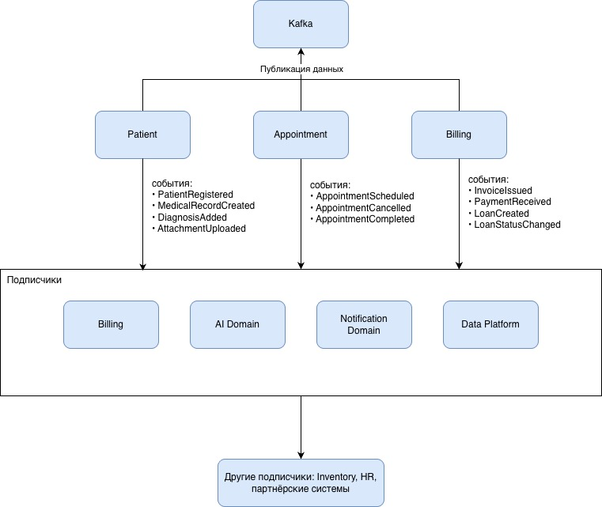

# Сдача проектной работы 11 спринта

## Задание 1. Модульная инфраструктура для нескольких сред

### Файлы в модуле [modules/vm/](Task1Advanced/modules/vm/)

- variables.tf — определяет входные параметры модуля. Это «интерфейс» модуля: какие данные он ожидает получить.
- outputs.tf — определяет выходные данные модуля, которые модуль возвращает после создания ресурсов
- main.tf — содержит ресурсы, которые создаёт модуль (диск, ВМ).

### Файлы в окружении [envs/](Task1Advanced/modules/envs/)

Каждое окружение — это корневая конфигурация Terraform, которая использует модуль. У неё своя цель:

variables.tf (окружения) — определяет переменные, которые нужны конкретно этому окружению для работы. Сюда входят:

- учётные данные для провайдера Yandex Cloud (token, cloud_id, folder_id);
- параметры, которые будут переданы в модуль, чтобы их можно было задать через terraform.tfvars;

terraform.tfvars — файл со значениями переменных, определённых в variables.tf окружения.
Здесь задаются конкретные цифры и строки для dev-среды, для stage, для prod.

main.tf (окружения) — содержит:

- Настройку провайдера (Yandex Cloud).
- Вызов модуля vm с передачей ему нужных параметров.

outputs.tf (окружения) — необязательный файл. Если он есть, то определяет, какие значения нужно вывести пользователю
после применения конфигурации. Например, можно вывести IP-адрес созданной ВМ, обратившись к выходным данным модуля.

### Для запуска

- Установленный Terraform.
- Аккаунт в Yandex Cloud с созданным облаком и каталогом.
- OAuth-токен для доступа к API Yandex Cloud.
- SSH-ключ для доступа к виртуальной машине. Если ключа нет, создайте:

```bash
ssh-keygen -t rsa -f ~/.ssh/id_rsa -N ""
```

- Идентификаторы подсетей в каждой зоне для окружений. Их можно получить из консоли Yandex Cloud или через CLI.
- Для каждого окружения (dev, stage, prod) необходимо заполнить файл terraform.tfvars в соответствующем каталоге.
  Определить параметр для подключения yandex_token - OAuth-токен

### Развёртывание инфраструктуры:

1. Перейдите в каталог нужного окружения

```bash
cd envs/dev          # или stage, prod
```

2. Инициализируйте Terraform (загрузит провайдер и модуль)

```bash
terraform init
```

3. Просмотрите план изменений

```bash
terraform plan
```

4. Примените конфигурацию для создания ресурсов

```bash
terraform apply
```

Полноценно протестировать не удалось. Не доступно зеркало для скачивания образов:

```
│ Error: Failed to query available provider packages
│
│ Could not retrieve the list of available versions for provider yandex-cloud/yandex: failed to query provider mirror https://terraform-provider.yandexcloud.net/ for
│ registry.terraform.io/yandex-cloud/yandex: response has invalid Content-Type: must be application/json
```

## Задание 2. Интеграция с CI/CD и удалённым хранением состояния

### Предварительные требования

1. Аккаунт в Yandex Cloud, созданное облако и каталог.
2. Сервисный аккаунт с ролью `editor` в каталоге.
3. Статический ключ доступа для сервисного аккаунта (получить через `yc iam access-key create`).
4. Бакет в Yandex Object Storage (например, `tfstate-bucket-dev`) с включённым версионированием.
5. Установленный Terraform.

### Настройка бэкенда

1. Перейдите в папку `envs/dev`.
2. Скопируйте `backend-dev.conf.example` в `backend-dev.conf` и укажите реальные данные бакета и ключей.
3. Инициализируйте Terraform:
   ```bash
   terraform init -reconfigure -backend-config=backend-dev.conf
   ```
4. В terraform.tfvars и отредактируйте, подставив свои cloud_id, folder_id, subnet_id и путь к SSH-ключу

CI/CD с GitHub Actions

### Необходимые секреты в репозитории

YC_STATIC_ACCESS_KEY - Идентификатор статического ключа
YC_STATIC_SECRET_KEY - Секретный ключ
YC_CLOUD_ID ID - вашего облака
YC_FOLDER_ID - ID каталога
TF_STATE_BUCKET - Имя бакета для state-файлов

### Безопасность

- Все секреты передаются через переменные окружения и секреты GitHub.
- Статические ключи используются как для бэкенда, так и для провайдера Yandex.
- Файлы с чувствительными данными (*.tfvars, backend-*.conf, *.json) добавлены в .gitignore.
- В CI/CD конфигурация бэкенда создаётся динамически и не сохраняется в репозитории.

### Описание файлов CI/CD: plan.yml и apply.yml

В проекте используются два основных workflow GitHub Actions для автоматизации Terraform в окружении dev:

- plan.yml – запускается при создании или обновлении Pull Request (PR) и выполняет terraform plan, публикуя результат в
  комментариях к PR.
- apply.yml – запускается после мержа PR (push в целевую ветку) и выполняет terraform apply для применения изменений.

#### plan.yml Шаги

- checkout – клонирует репозиторий.
- setup-terraform – устанавливает Terraform нужной версии.
- Configure backend – создаёт временный конфигурационный файл для бэкенда, подставляя значения из секретов.
- Terraform Init – инициализирует рабочую директорию с этим бэкендом.
- Terraform Plan – выполняет terraform plan и выводит результат в лог (всё видно в интерфейсе Actions).

#### apply.yml Отличия от plan.yml

- Триггер – push в ветку develop (т.е. после мержа PR).
- Шаг Terraform Apply – использует флаг -auto-approve, что соответствует требованию «apply по кнопке или с флагом
  approval».
- Все остальные шаги идентичны, что гарантирует одинаковое окружение для plan и apply.

Полноценно протестировать не удалось. Не доступно зеркало для скачивания образов:

```
│ Error: Failed to query available provider packages
│
│ Could not retrieve the list of available versions for provider yandex-cloud/yandex: failed to query provider mirror https://terraform-provider.yandexcloud.net/ for
│ registry.terraform.io/yandex-cloud/yandex: response has invalid Content-Type: must be application/json
```

## Задание 3. Проектирование целевой архитектуры и оценка рисков внедрения


Основные контейнеры

- Клиентские приложения — веб/мобильные интерфейсы для врачей, пациентов, сотрудников.
- API Gateway (Kong) — единая точка входа, маршрутизация, аутентификация (проверка JWT через Keycloak).
- Бизнес-домены (Patient, Billing, Inventory, HR, AI) — независимые микросервисы с собственными БД (PostgreSQL),
  реализующие бизнес-логику.
- Платформа данных — централизованный слой для сбора, хранения, обработки и предоставления данных аналитикам.
  Включает Kafka, Data Lake (S3), Flink, Trino, Superset, инструменты управления (Ranger, Amundsen).

Как эта архитектура решает задачи компании:

- Портал самообслуживания реализован через Superset + Trino — пользователи получают доступ ко всем данным без участия
  ИТ, но с контролем доступа через Ranger.
- Интеграция новых направлений — новые домены просто начинают публиковать события в Kafka и могут читать данные через
  Trino.
- Отказ от легаси — старый DWH выводится после миграции всех исторических данных в Data Lake; PowerBuilder заменён
  современным веб-интерфейсом.
- Near-real-time аналитика — за счёт потоковой обработки Flink и возможности Trino запрашивать данные прямо из Kafka.

### Риски трансформации и план управления

#### 2. Карта рисков трансформации

| Категория       | Риск                                        | Описание                                                                                                                                                                                          | Вероятность | Влияние     |
|:----------------|:--------------------------------------------|:--------------------------------------------------------------------------------------------------------------------------------------------------------------------------------------------------|:------------|:------------|
| Архитектурный   | «Разрывы данных» при миграции               | При отказе от легаси DWH часть истории может быть потеряна или повреждена в процессе миграции в новый Data Lake.                                                                                  | Средняя     | Высокое     |
| Архитектурный   | «Событийный ад»                             | Внедрение Kafka усложняет трассировку транзакций. Трудно гарантировать exactly-once доставку и порядок событий при сбоях, что приведет к рассинхронизации отчетности.                             | Высокая     | Высокое     |
| Технологический | Утечка медицинских/финансовых данных        | Переход в облако и распределенная архитектура увеличивают поверхность атаки. Данные перемещаются между доменами, появляется риск несанкционированного доступа аналитиков к чувствительным данным. | Средняя     | Критическое |
| Организационный | Сопротивление персонала / потеря экспертизы | Команда знает SQL Server 2008, но не знает Kafka и Trino. Бизнес-пользователи привыкли к старым отчетам и не доверяют новым витринам.                                                             | Высокая     | Среднее     |
| Архитектурный   | Регуляторные санкции                        | Медицина и финансы строго регулируются. Геораспределенное облако может нарушить закон о персональных данных.                                                                                      | Низкая      | Критическое |
| Технологический | Замедление Time‑to‑Market                   | Желание все декомпозировать на микросервисы приведет к тому, что простой отчет потребует согласования API пяти доменов, что парализует разработку.                                                | Средняя     | Высокое     |
| Организационный | Конфликт доменов                            | Домены  могут захотеть строить свои «частные» витрины данных, отказываясь публиковать качественные данные в общую шину.                                                                           | Средняя     | Среднее     |

### 3. План управления рисками

#### 3.1. Технические решения

| Риск           | Мера                                                                                                                                                                                                           | Ожидаемый результат                                            |
|:---------------|:---------------------------------------------------------------------------------------------------------------------------------------------------------------------------------------------------------------|:---------------------------------------------------------------|
| Разрывы данных | Стратегия «пузыря» (Bubble Context): старые данные остаются в архивном DWH  и подключаются через антикоррупционный слой (Camel) до полной миграции.                                                            | Сохранение истории без повреждения, плавный переход.           |
| Событийный ад  | Внедрение Schema Registry для контрактов данных, использование Change Data Capture (Debezium) для гарантии сохранности событий, централизованный лог событий в Data Lake для возможности пересчета состояний . | Консистентность событий, возможность отладки и восстановления. |
| Утечка данных  | Маскировка данных на уровне портала (Trino), выделенные ноды в облаке для критичных баз, шифрование в покое и при передаче, строгое разделение: медицинские карты не попадают в Data Lake для аналитики.       | Снижение риска утечки, соответствие требованиям регуляторов.   |
| Замедление T2M | Создание BFF (Backend for Frontend) для отчетов, который агрегирует данные из разных доменов, и использование API Gateway для унификации вызовов.                                                              | Ускорение разработки отчетов, снижение связности.              |

### 3.2. Управленческие подходы

| Риск                             | Мера                                                                                                                                                                   |
|:---------------------------------|:-----------------------------------------------------------------------------------------------------------------------------------------------------------------------|
| Сопротивление, потеря экспертизы | Обучение ключевых аналитиков работе с Trino и DBT, наем техлида с экспертизой в Kafka, параллельная работа старой и новой систем до совпадения двух циклов отчетности. |
| Регуляторные санкции             | Compliance‑as‑Code: юристы и security описывают требования, DevOps реализуют через политики облака.                                                                    |
| Конфликт доменов                 | Финансирование платформенной команды централизовано, стоимость легаси закладывается в бюджеты доменов, стимулируя переход.                                             |

## Задание 4. Моделирование домена и интеграций

### 1. Разделение на домены (DDD) и bounded contexts

| Домен                         | Ответственность                                                                                      | Важные события                                                                            |
|:------------------------------|:-----------------------------------------------------------------------------------------------------|:------------------------------------------------------------------------------------------|
| Patient (Пациенты)            | Управление профилями пациентов, медицинскими картами, историями болезней, результатами исследований. | • PatientRegistered<br>• MedicalRecordCreated<br>• DiagnosisAdded<br>• AttachmentUploaded |
| Appointment (Запись на приём) | Управление расписанием, записью пациентов к врачам, уведомлениями.                                   | • AppointmentScheduled<br>• AppointmentCancelled<br>• AppointmentCompleted                |
| Billing (Расчёты)             | Финансовые операции: выставление счетов, приём платежей, кредиты, финансовая история.                | • InvoiceIssued<br>• PaymentReceived<br>• LoanCreated<br>• LoanStatusChanged              |
| Inventory (Аптечный склад)    | Учёт лекарств, оборудования, интеграция с поставщиками.                                              | • StockLevelChanged<br>• ShipmentArrived<br>• ReorderSuggested                            |
| HR (Персонал)                 | Данные сотрудников, графики работы, зарплаты.                                                        | • EmployeeHired<br>• ScheduleAssigned<br>• PayrollProcessed                               |
| AI (ИИ-сервисы)               | Обработка медицинских данных.                                                                        | • AnalysisRequested<br>• AnalysisCompleted<br>• AnomalyDetected                           |
| Notification (Уведомления)    | Централизованная отправка уведомлений.                                                               | Подписывается на события других доменов; сама публикует NotificationSent                  |

## 2. Событийная архитектура (Event Storming)

#### Диаграмма потоков событий



#### Описание ключевых событий и их маршрутов

| Событие              | Описание                      |
|:---------------------|:------------------------------|
| PatientRegistered    | Пациент зарегистрирован.      |
| MedicalRecordCreated | Появилась новая медкарта.     |
| AppointmentScheduled | Запись создана.               |
| AppointmentCompleted | Приём завершён.               |
| InvoiceIssued        | Выставлен счёт.               |
| PaymentReceived      | Оплата прошла.                |
| LoanCreated          | Оформлен кредит.              |
| AnalysisCompleted    | Результаты ИИ-анализа готовы. |
| StockLevelChanged    | Изменился остаток.            |
| EmployeeHired        | Новый сотрудник.              |

### 3. Обоснование выбора событийного подхода

#### 3.1. Проблемы текущей архитектуры (Camel + DWH)

- Высокая связность: ESB (Camel) выступает «умной шиной», содержащей много бизнес-логики.
  Изменение в одном сервисе часто требует правки шины и DWH.
- Монолитное хранилище: DWH хранит данные всех доменов в одной модели, что замедляет внесение изменений.
- Пакетная обработка: Отчётность строится на батчах, time‑to‑market для новых отчётов измеряется неделями.
- Запаздывание данных: Информация поступает в DWH с задержкой, невозможно строить near‑real‑time аналитику.

#### 3.2. Преимущества событийно-ориентированной архитектуры

| Преимущество                                             | Как достигается                                                                | Выгода                                                  |
|:---------------------------------------------------------|:-------------------------------------------------------------------------------|:--------------------------------------------------------|
| Слабая связность                                         | Домены общаются только через события в Kafka.                                  | Ускорение разработки.                                   |
| Масштабируемость                                         | Каждый домен масштабируется независимо.                                        | Рост числа клиентов и регионов без перепроектирования.  |
| Скорость реакции (near‑real‑time)                        | События обрабатываются потоковыми процессорами.                                | Бизнес получает отчёты с минимальной задержкой.         |
| Гибкость интеграции новых партнёров                      | Партнёр просто подключается к нужным топикам Kafka или публикует свои события. | Новые направления интегрируются быстрее.                |
| Надёжность и восстановление                              | События хранятся в Kafka долго, можно переиграть состояние.                    | Возможность восстановить данные после сбоя.             |
| Поддержка аналитики без нагрузки на операционные системы | Аналитики читают из Data Lake не трогая БД доменов.                            | Не нагрузки на операционные базы из‑за тяжёлых отчётов. |
| Соответствие требованиям Data Mesh                       | Каждый домен владеет своими данными и публикует их через события.              | Устраняется единый владелец.                            |

#### 3.4. Итог

Переход на событийную архитектуру позволяет:

- Быстро масштабировать бизнес;
- Интегрировать партнёров без перепроектирования;
- Получить near‑real‑time аналитику;
- Снизить стоимость поддержки;
- Повысить отказоустойчивость.